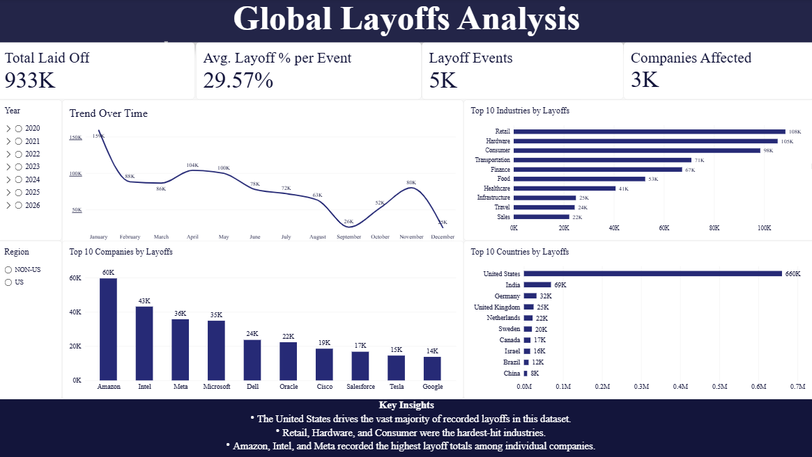

# Global Layoffs Analysis

This is a data analytics project analyzing global tech layoffs from 2020 to 2026, built as a standalone Power BI project.

The project is intentionally built end-to-end inside Power BI, using Power Query for cleaning and Power BI's data model and DAX for analysis, to demonstrate independent proficiency in the tool without relying on a separate SQL or Python cleaning stage.

The purpose of the project is to understand which companies, industries, and regions were most affected by layoffs, how layoff activity changed over time, and to surface a few clear takeaways from the data.

## Dashboard Preview



## Project Structure

```
layoffs-data-analysis/
├── data/
│   └── layoffs.csv
├── images/
│   └── layoffs-analysis-dashboard.png
├── layoffs_dashboard.pbix
└── README.md
```

The dataset is sourced from Kaggle's "Layoffs Dataset" (originally compiled from Layoffs.fyi), tracking startup and tech company layoffs since 2020, and is included in this repository.

## Workflow

### 1. Power Query - Data Cleaning

The raw dataset contains 999+ rows of company layoff events. Cleaning was done entirely in Power Query and includes:

- Setting correct data types (whole number, decimal, percentage, and date fields)
- Splitting the `location` column into city and a US/Non-US region flag
- Rebuilding the region flag from `country` (using a conditional column) instead of parsed text, to avoid inconsistencies in the original formatting
- Standardizing inconsistent company name casing (e.g. "Tiktok" vs "TikTok", "LOOP" vs "Loop", "MARA" vs "Mara") using a grouped, lowercase comparison to catch every case-mismatch pair
- Trimming whitespace from text fields
- Adding a `source_type` column to flag whether a record's source was a URL or an internal memo
- Removing exact duplicate rows

"TikTok" and "TikTok India" were kept as distinct entries rather than merged, since TikTok's India operations were shut down entirely in 2020 — a separate event from other TikTok layoffs elsewhere.

### 2. Power BI - Data Model and Measures

Core DAX measures built for the dashboard:

- `Total Laid Off` - sum of reported layoffs
- `Layoff Events` - count of layoff records
- `Avg. Layoff % per Event` - average reported percentage of workforce cut per event
- `Companies Affected` - distinct count of companies

### 3. Power BI - Dashboard

The dashboard includes:

- KPI cards for total laid off, average layoff percentage, layoff events, and companies affected
- A monthly trend chart showing layoff activity over time
- A ranked bar chart of the top 10 industries by total layoffs
- A ranked chart of the top 10 companies by total layoffs
- A ranked chart of the top 10 countries by total layoffs
- Year and Region (US / Non-US) slicers for interactive filtering
- A key insights section summarizing the main findings

## Metric Definitions

| Metric | Definition |
|---|---|
| Total Laid Off | Sum of reported employees laid off across all events |
| Avg. Layoff % per Event | Average of the reported percentage of workforce cut, per layoff event (not a company-size-weighted overall percentage) |
| Region | Based on company headquarters country, not the office location where the layoff occurred |

`Region` and `country` reflect the company's headquarters, not necessarily the location of the specific office affected by a given layoff event. This is a property of the original dataset, not an artifact of cleaning.

## Key Insights

- The United States drives the vast majority of recorded layoffs in this dataset.
- Retail, Hardware, and Consumer were the hardest-hit industries.
- Amazon, Intel, and Meta recorded the highest layoff totals among individual companies.
- Layoff activity was volatile rather than steady, with sharp peaks and drops across the year rather than a consistent trend.

## Data Quality Notes

This dataset reflects publicly reported tech and startup layoffs (sourced from Layoffs.fyi via Kaggle), not a complete record of all layoffs globally. Conclusions drawn from it describe reported layoffs in this dataset, not layoffs as a whole.

- The dataset spans **March 2020 to September 2026**.
- **~34.7% of records are missing `total_laid_off`**, and **~37.3% are missing `percentage_laid_off`**. These are treated as unknown, not zero, and are excluded from sum/average calculations rather than imputed.
- **2026 is a partial year** (year-to-date through September). Layoff totals for 2026 should be read as YTD figures, not compared directly against complete prior years.
- A small number of records have a `date_added` earlier than the reported layoff `date`. These were kept as-is; they may reflect legitimate data corrections upstream rather than errors, but no assumption was made about which is correct.

## How to Run the Project

### 1. Download the Dataset

The dataset is included in this repository under `data/layoffs.csv`. It can also be downloaded directly from Kaggle:

https://www.kaggle.com/datasets/swaptr/layoffs-2022

### 2. Open the Dashboard

Open `layoffs_dashboard.pbix` in Power BI Desktop. All cleaning steps and measures are contained within the file and will refresh automatically if the source CSV is replaced or updated.

## Limitations

- This dataset only reflects publicly reported layoffs and does not capture every layoff event that occurred in this period.
- `Region` and `country` are based on company headquarters, not the specific office location affected by a given layoff.
- The Avg. Layoff % per Event measure averages reported percentages across events; it does not represent the percentage of total employees laid off across the whole dataset.

## Tools Used

- Power Query - data cleaning and transformation
- Power BI - data modeling, DAX measures, and dashboard design

## Author

Aya - MIS Student, Lebanese University
